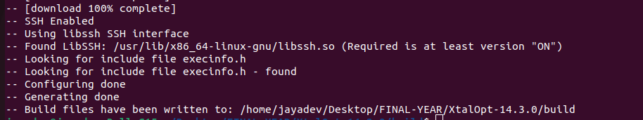
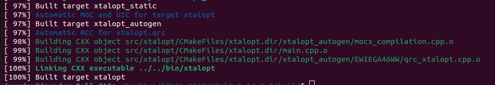
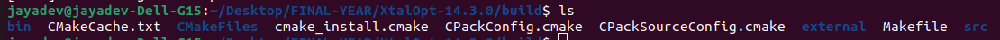
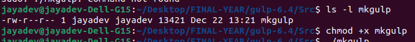
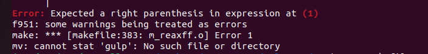
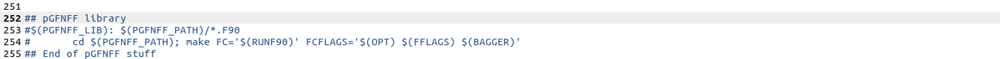
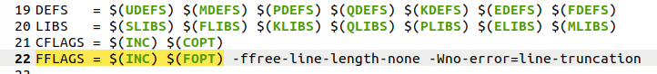
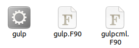
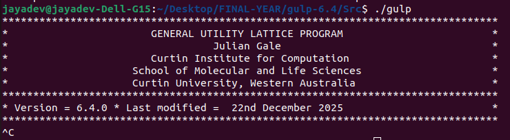

# Building XtalOpt

## Installation Steps

**Step 1:** Download the source code Linux build from: https://xtalopt.github.io/install-linux.html

**Step 2:** Install build essentials
```bash
sudo apt install build-essential
```

**Step 3:** Install other dependencies
```bash
sudo apt install git cmake qtbase5-dev libqwt-qt5-dev libeigen3-dev libssh-dev
```

**Step 4:** Configure the build
```bash
mkdir build
cd build
cmake ..
```



**Step 5:** Compile the code (from build directory)

Once the build completes successfully, you can compile the code:
```bash
make
```



> **Note:** Ignore the warnings encountered during compilation; many are just deprecation issues.

Ensure that compilation is successful.

**Step 6:** Verify all necessary files have been compiled and built



## Running the Application

You can start the application in any of the following ways from the build directory:

1. **GUI mode:** `./bin/xtalopt`
2. **CLI mode:** `./bin/xtalopt --cli`

> **Note:** Running in CLI mode requires extra configuration, which includes copying templates of the corresponding optimizer and `xtalopt.in` from the source repository.

---

# Setting up GULP for XtalOpt

**Step 1:** Get GULP source code from: https://gulp.curtin.edu.au/

**Step 2:** Prepare the build directory
```bash
cd Src
chmod +x mkgulp
```



This allows us to build an executable.

**Step 3:** Build the executable 
```bash
./mkgulp
```



### Troubleshooting Build Issues

You might encounter issues during the build. If so, edit the makefile:

- Comment out the following lines from 252-255
  
- Then edit line 22
  

Run the following commands:
```bash
make clean
./mkgulp
```

Once the build is successful, you will find a file named `gulp`.



**Verify GULP installation:**
```bash
./gulp
```

